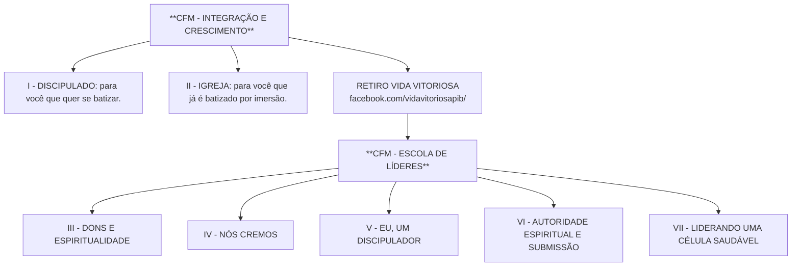
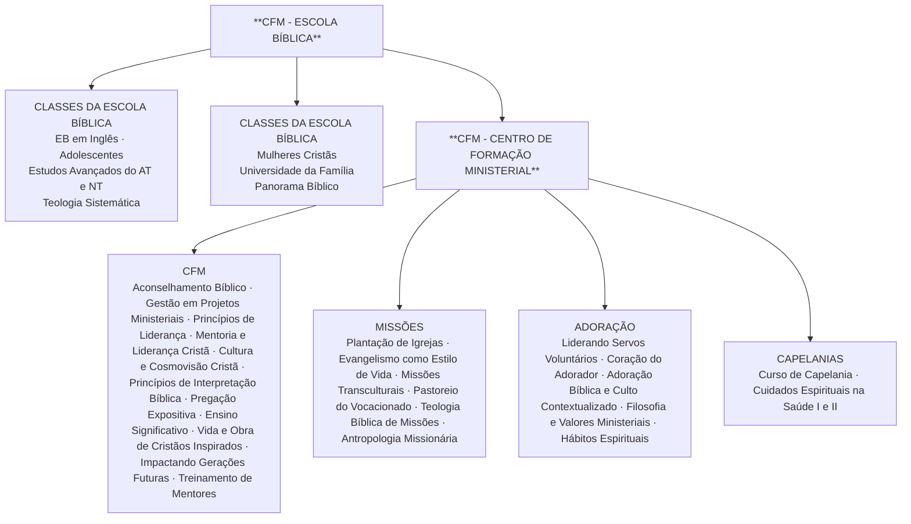

# III — Dons e Espiritualidade

**CFM – Escola de Líderes**
Primeira Igreja Batista de Curitiba — Área Ministerial de Educação Cristã
Curitiba, 2019 — 2ª edição

---

> *Documento convertido do PDF original (96 páginas, PIB Curitiba, 2019). O texto foi preservado integralmente, incluindo as gralhas do original. Imagens e elementos decorativos foram removidos; os fluxogramas "Sua Caminhada" (linha básica e linha avançada) e os processos de integração foram recriados em Mermaid, e os quadros do original viraram tabelas.*

---

## Ficha catalográfica

**Comitê editorial**

- Carlos Gustavo Cecyn Lundgren
- Paschoal Piragine Jr

**Fundamentação teológica**

- Igor Pohl Baumann
- Paschoal Piragine Jr
- Carlos Gustavo Cecyn Lundgren

**Redação final**

- Janete Maria de Oliveira
- Juliane Queirolo Carneiro Santos

**Diagramação**

- Gabriela Dal Toé Fortuna
- Priscilla Gonçalves Lopes

**Capa**

- Lucas de Oliveira Santos

**Revisão final**

- Martha Christina Zimermann de Morais
- Carlos Gustavo Cecyn Lundgren

Paschoal Piragine Júnior — Pastor Titular e Presidente da Primeira Igreja Batista de Curitiba

Área Ministerial de Educação Cristã
CFM – Escola de Líderes
Caderno III – Dons e Espiritualidade
Curitiba – 2019 — 2ª edição — Tiragem: 300 exemplares

**Primeira Igreja Batista de Curitiba**
R. Bento Viana, 1200, Batel - 80240-110 - Curitiba - PR
Telefone: (41) 3091-4347
E-mail: edcrista@pibcuritiba.org.br

---

## Sumário

- [Introdução — Linha de Ensino](#introdução--linha-de-ensino)
- [Organize-se!](#organize-se)
- [Aula 1 — Eu, um servo?](#aula-1--eu-um-servo)
- [Aula 2 — Santificação, oração e disciplinas espirituais](#aula-2--santificação-oração-e-disciplinas-espirituais)
- [Aula 3 — Vida de oração e crescimento espiritual](#aula-3--vida-de-oração-e-crescimento-espiritual)
- [Aula 4 — Palavra de Deus](#aula-4--palavra-de-deus-princípios-de-interpretação-e-seitas)
- [Aula 5 — Espírito Santo](#aula-5--o-espírito-santo-o-fruto-e-o-caráter-cristão)
- [Aula 6 — Dons espirituais](#aula-6--dons-espirituais)
- [Aula 7 — Análise do teste de dons](#aula-7--análise-do-teste-de-dons)
- [Referências](#referências)
- [Anexo — Teste de dons](#anexo--teste-de-dons)

---

# Introdução — Linha de Ensino

## CFM - Integração e Crescimento

O primeiro passo no seu crescimento espiritual na PIB Curitiba é chamado de CFM - Integração e Crescimento, quando você se prepara para se filiar à igreja local. Cada pessoa que chega na igreja tem uma história, e pensando nisso a PIB Curitiba preparou um processo especial que se aplica a todas elas. Existem quatro maneiras de se integrar na igreja. Veja em qual você se encaixa:

**1. Batismo:** *para quem está iniciando agora sua caminhada com Cristo e deseja assumir um compromisso com o Senhor, batizando-se por imersão.*

**2. Aclamação:** *para quem está vindo de outra denominação e já é batizado(a) nas águas por imersão em nome do Pai e do Filho e do Espírito Santo.*

**3. Transferência:** *para quem está vindo de outra igreja batista filiada à Convenção Batista Brasileira, à qual a própria PIB Curitiba está vinculada.*

Antes da Assembleia Administrativa, os novos membros são convidados para participar da Festa de Integração: o momento de festejar sua chegada na igreja. A Festa de Integração é agendada de acordo com a data da Assembleia Administrativa. Consulte o Ministério de Integração para saber a data correta.

**4. Reconciliação:** *para quem um dia conheceu o Senhor Jesus e por algum motivo deixou os seus caminhos, mas agora quer novamente retomar sua vida com Ele firmemente.*

*Processo: Marque um horário na secretaria do Ministério de Integração para que o pastor possa conversar com você e lhe orientar em um processo personalizado. Procure conhecer o programa chamado "Celebrando a Recuperação" que temos em nossa igreja.*

### Batismo de Juniores

No caso do batismo de juniores, é necessário, primeiramente, uma entrevista com o pastor ou ministro responsável do Ministério Infantil. **Os módulos são cíclicos, portanto você pode iniciar quando desejar.**

### Retiro Vida Vitoriosa

Todos os que foram recebidos como membros são convidados a participar do Retiro Vida Vitoriosa. Esse retiro proporcionará uma revisão da sua vida, auxiliando-o no seu desenvolvimento espiritual.

**Mais informações:** vidavitoriosa@pibcuritiba.org.br

**Contato:** (41) 3091-4358 | integracao@pibcuritiba.org.br

### CFM - Escola de Líderes

A Escola de Líderes é a segunda etapa de crescimento formal dentro da PIB. A primeira, como você viu anteriormente, é a filiação na igreja local, através do Módulo CFM - Integração e Crescimento. Seguindo a sua filiação, a pessoa é direcionada para o CFM - Escola de Líderes.

Escola de Líderes, a qual tem a missão de despertar, desenvolver e aplicar o dom espiritual na dinâmica da vida eclesiástica. O cristão genuinamente salvo por Cristo, possui um dom espiritual que deve ser exercitado por intermédio do serviço. Por isso, ele ao compreender sua missão pode ser considerado um líder espiritual, que será impactar a vida de outros.

Para concretizar sua missão, a Escola de Líderes é composta por cinco disciplinas. Juntas, essas cinco disciplinas contribuirão para a formação de uma liderança bíblica, consistente e atuante na dinâmica de nossa comunidade de fé.

- III - Dons e Espiritualidade
- IV - Nós Cremos
- V - Eu, um Discipulador
- VI - Autoridade Espiritual e Submissão
- VII - Liderando uma Célula Saudável

O aluno CFM - Escola de Líderes deve ser uma pessoa convertida, que manifesta o fruto de Espírito Santo em sua vida, e que deseja ser preparado continuamente para a obra de Deus no poder do Espírito Santo.

**Contato:** (41) 3091-4309 | cfm@pibcuritiba.org.br

### CFM - Liderança, Missões e Adoração

O CFM - Liderança, Missões e Adoração, o qual tem como objetivo ampliar a relevância da liderança ao capacitar líderes segundo o padrão de Deus, para o exercício da missão cristã.

Queremos uma transformação genuína na vida e no caráter cristão e a restauração de valores cristãos essenciais para o ministério. Desejamos instrumentar as pessoas através de aulas, semanas de imersão, retiros, mentoria e atividades práticas para realizarem seus ministérios com excelência. Os professores do CFM são cristãos experientes que inspiram os alunos e os guiam em direção à excelência no desempenho da vivência e proclamação do Evangelho de Jesus Cristo.

> **Horários:** *terças e quintas-feiras, das 19h às 22h, e uma hora semanal para o encontro de mentoria (a combinar com o mentor). As aulas são ministradas nas dependências da Primeira Igreja Batista de Curitiba.*

**Contato:** (41) 3091-4309 | cfm@pibcuritiba.org.br

### CFM - Escola Bíblica

"Tendo acabado de falar, disse a Simão: 'Vá para onde as águas são mais fundas' e a todos: 'Lancem as redes para a pesca'" (Lucas 5.4). Ao ouvir o Mestre, Pedro decide obedecer. A pesca, que até então, estava sem sucesso, tornou-se uma das melhores experiências de sua vida. Da mesma forma o Senhor convida seus filhos a irem cada vez mais fundo num relacionamento íntimo e verdadeiro com Ele.

Inspirados nEle e por Ele, o Ministério de Educação Cristã criou oportunidades para o fortalecimento da igreja, através da Escola Bíblica. Desafiando os membros e frequentadores a PIB Curitiba a irem mais fundo no relacionamento com a Palavra de Deus, com o propósito de serem exemplos vivos do amor dEle, em nossa sociedade.

Mesmo que você ainda não tenha feito o CFM - Escola de Líderes e CFM - Liderança e Missões, pode participar das classes da Escola Bíblica.

> \* Para saber mais dias e horários acesse: www.pibcuritiba.org.br/escolabiblica/

**Contato**

- www.pibcuritiba.org.br/cfm
- cfm@pibcuritiba.org.br
- facebook.com/cfmpibcuritiba
- (41) 3091-4309

### Sua Caminhada — Linha básica

### Sua Caminhada — Linha avançada

---

## Organize-se!

Anote aqui a data em que se realizaram ou se realizarão cada um dos encontros.

| Aula | Tema | Data do encontro |
|---|---|---|
| 1 | Eu, um servo? | _____/_____/_____ |
| 2 | Santificação, oração e disciplinas espirituais | _____/_____/_____ |
| 3 | Vida de oração e crescimento espiritual | _____/_____/_____ |
| 4 | Palavra de Deus | _____/_____/_____ |
| 5 | Espírito Santo | _____/_____/_____ |
| 6 | Dons espirituais | _____/_____/_____ |
| 7 | Análise do teste de dons | _____/_____/_____ |
| 8 | Teste de dons | _____/_____/_____ |

---

# Aula 1 — Eu, um servo?

> **Objetivos da aula:**
>
> 1. Desenvolver, a partir de textos bíblicos, o conceito de liderança servidora, ensinado por Jesus;
> 2. Comparar o conceito secular e bíblico de "servo";
> 3. Estimular a reflexão sobre o contraste entre o serviço cristão e a hierarquia secular.

> *Vocês não me escolheram, mas eu os escolhi para irem e darem fruto, fruto que permaneça, a fim de que o Pai lhes conceda o que pedirem em meu nome.*
> — João 15.16 (NVI)

## Introdução

Fomos convocados por Deus para implantação do seu Reino na terra, para tanto somos chamados a uma vida de devoção, que envolve oração e leitura diária da Bíblia, onde primeiramente e individualmente me volto para Deus; para uma missão que é a proclamação do evangelho; para o serviço cristão, onde cada uma tem uma obra específica a ser feita e para a celebração que envolve o culto na igreja local e comunhão.

Devoção, missão, serviço e celebração são aspectos da vida cristã interdependentes devendo assim ser observados exatamente nesta ordem de colocação. Freqüentamos uma igreja local para celebrar, pois nos unimos a Deus novamente, o que nos direciona a devoção, celebramos porque temos uma missão e um serviço específico para realizar, ou seja, fazer com que outras pessoas possam se voltar para Deus em um relacionamento profundo e produtivo.

Nestes aspectos da vida cristã temos um sentimento e posição onde devemos tomar consciência diariamente que é a posição de servo. Fomos chamados para servir, o propósito de Deus para nossa vida é que imitemos as atitudes de Jesus, obedecendo ao Pai e desenvolvendo, na prática, um serviço amoroso a favor das pessoas. Observe o que diz Paulo diz em Filipenses 2.3-8:

> *"Nada façais por contenda ou por vanglória, mas por humildade; cada um considere os outros superiores a si mesmo. Não atente cada um para o que é propriamente seu, mas cada qual também para o que é dos outros. De sorte que haja em vós **o mesmo sentimento** que houve também em Cristo Jesus, que, sendo em forma de Deus, não teve por usurpação ser igual a Deus, Mas esvaziou-se a si mesmo, tomando a forma de servo, fazendo-se semelhante aos homens; E, achado na forma de homem, humilhou-se a si mesmo, sendo obediente até à morte, e morte de cruz." (NVI)*

## Significado de servo

Precisamos refletir o que é ser um servo, como princípio bíblico.

**O que vem à sua mente quando você ouve a palavra servo?**

_________________________________________________________________

_________________________________________________________________

O conceito multicultural de servo quer dizer escravo e se refere muitas vezes a violência, desrespeito à dignidade, falta de liberdade de ir e vir, trabalho sem recompensa e até castigos cruéis. Fora do contexto espiritual são estes os sentidos, mas em seus ensinos Jesus usa esse termo e ainda nos recomenda a atitude de servo, uma vez que o status de servo era comum nos tempos de Jesus. Em Mateus 20.20-28 mostra um episódio que Jesus faz essa recomendação:

> *"Então, aproximou-se de Jesus a mãe dos filhos de Zebedeu com seus filhos e, prostrando-se, fez-lhe um pedido. "O que você quer?", perguntou ele. Ela respondeu: "Declara que no teu Reino estes meus dois filhos se assentarão um à tua direita e o outro à tua esquerda".*
>
> *Disse-lhes Jesus: "Vocês não sabem o que estão pedindo. Podem vocês beber o cálice que eu vou beber?" "Podemos", responderam eles.*
>
> *Jesus lhes disse: "Certamente vocês beberão do meu cálice; mas o assentar-se à minha direita ou à minha esquerda não cabe a mim conceder. Esses lugares pertencem àqueles para quem foram preparados por meu Pai".*
>
> *Quando os outros dez ouviram isso, ficaram indignados com os dois irmãos.*
>
> *Jesus os chamou e disse: "Vocês sabem que os governantes das nações as dominam, e as pessoas importantes exercem poder sobre elas.*
>
> *Não será assim entre vocês. Pelo contrário, quem quiser tornar-se importante entre vocês **deverá ser servo**, e quem quiser ser o primeiro **deverá ser escravo**; como o Filho do homem, que não veio para ser servido, mas **para servir** e dar a sua vida em resgate por muitos." (NVI)*

Esse texto nos mostra que um servo tem como função específica o de servir, ou seja, ser dominado por alguém, e que essa é uma exigência para quem faz parte do Reino de Deus.

Em Lucas 17.7-11 Jesus está falando sobre perdão, mas ele também nos mostra qual era a condição de um servo naqueles tempos, vejamos:

> *"Qual de vocês que, tendo um servo que esteja arando ou cuidando das ovelhas, lhe dirá, quando ele chegar do campo: 'Venha agora e sente-se para comer'? Pelo contrário, não dirá: 'Prepare o meu jantar, apronte-se e sirva-me enquanto como e bebo; depois disso você pode comer e beber'? Será que ele agradecerá ao servo por ter feito o que lhe foi ordenado? Assim também vocês, quando tiverem feito tudo o que lhes for ordenado, devem dizer: **'Somos servos inúteis; apenas cumprimos o nosso dever'**" (NVI)*

A atitude de servo deve ser uma constância na vida do cristão genuíno, independente da posição em que ocupa na igreja instituída. Jesus fala que a posição nos governos e lideranças fora do reino é de domínio, mas no seu reino não é assim, quem quiser ser grande e primeiro têm que ser servo. Jesus nos mostra isso na prática quando lavou os pés dos discípulos uma vez que essa função era específica do servo. Jesus é o nosso maior modelo de servo.

## Características de um servo de Jesus

Como vemos nas passagens anteriores um servo conforme o modelo de Jesus é aquele que serve os demais, é dominado pelo seu Senhor, faz tudo quando seu Senhor ordena e mesmo após termos cumprido todo nosso dever o sentimento que devemos ter é de inutilidade, isso é forte e contundente, porém se olharmos o quanto fomos agraciados pelo amor de nosso Senhor essa é uma verdade que deve ser refletida. O Apóstolo Paulo nos ensina em 2Coríntios 5.14-15:

> *"Pois o amor de Cristo nos constrange, porque estamos convencidos de que um morreu por todos; logo, todos morreram. E ele morreu por todos para que aqueles que vivem já **não vivam mais para si mesmos**, mas para aquele que por eles morreu e ressuscitou" (NVI).*

Quando nos vemos como servos nos libertamos de nós mesmos e somos dominados por Deus. Ao assumirmos a posição e atitude de servo, Deus não nos vê como servos, note o que ele disse aos seus discípulos:

> *O meu mandamento é este: amem-se uns aos outros como eu os amei. Ninguém tem maior amor do que aquele que dá a sua vida pelos seus amigos. Vocês serão meus amigos, **se fizerem o que eu lhes ordeno. Já não os chamo servos,** porque o servo não sabe o que o seu senhor faz. Em vez disso, eu os tenho chamado amigos, porque tudo o que ouvi de meu Pai eu lhes tornei conhecido.*
> — João 15.12-15 (NVI)

Neste texto verificamos que se fizermos tudo o que ele nos ordena somos classificados como amigos, notem que Jesus eleva seus seguidores de servos para amigos, e é uma posição bem diferente. O que é ser um amigo? Conforme dicionário Aurélio, amigo é uma pessoa ligada por relação amorosa, àquele que segue um mesmo partido, que se trata cordialmente, numa relação afetuosa de reciprocidade de ajuda e de favorecimento. É isso que acontece com quem cumpre as ordenanças de Jesus e se torna seu amigo. Abraão foi considerado amigo de Deus (Tiago 2.23; 2Crônicas 20.7 e Isaías 41.8). Paulo apesar de sua posição de Apóstolo primeiramente se apresentava como servo:

> *"Paulo, servo de Jesus Cristo, chamado para apóstolo, separado para o evangelho de Deus." Romanos 1.1*

> *"Paulo e Timóteo, servos de Jesus Cristo, a todos os santos em Cristo Jesus, que estão em Filipos, com os bispos e diáconos." Filipenses 1.1*

> *Ora, se eu, Senhor e Mestre, vos lavei os pés, vós deveis também lavar os pés uns aos outros. Porque eu vos dei o exemplo, para que, como eu vos fiz, façais vós também.*
> — João 13.14,15 (NVI)

## Considerações finais

Em nossa devoção, no cumprimento da missão, na execução do serviço para o crescimento do reino e na celebração a Deus devemos tomar consciência que somos apenas servos onde cumprimos tudo o Senhor nos ordena independente da posição que ocupamos no reino de Deus. Assim fazendo, o Senhor nos chama para uma relação de amizade onde vivemos uma relação amorosa, recíproca, de ajuda e favorecimento de Deus.

---

# Aula 2 — Santificação, oração e disciplinas espirituais

> **Objetivos da aula:**
>
> 1. Entender a importância da santidade na vida cristã;
> 2. Comparar o conceito bíblico e secular de "santo";
> 3. Apresentar princípios para a busca da santidade.

## Introdução

Em Romanos 12.2, o apóstolo Paulo desafia os cristãos residentes em Roma a viver na contramão do sistema do mundo:

> ***Não se amoldem ao padrão deste mundo,*** *mas transformem-se pela renovação da sua mente, para que sejam capazes de experimentar e comprovar a boa, agradável e perfeita vontade de Deus.*

Sabemos que a tendência natural da sociedade é para um declínio moral, conforme 2Timóteo 3.1-4. Assim, percebemos o desafio que se apresenta a cada cristão que deseja fazer a vontade de Deus, pois andar em santidade é viver na direção oposta do mundo.

Deus exige a santidade de seu povo já que Ele é santo, veja:

> *Falou mais o Senhor a Moisés, dizendo: Fala a toda a congregação dos filhos de Israel, e dize-lhes: Santos sereis, porque eu, o Senhor vosso Deus sou santo.*
> — Levítico 19.1-2

> *Mas, assim como é santo aquele que os chamou, sejam santos vocês também em tudo que fizerem, pois está escrito: "Sejam santos, porque eu sou santo".*
> — 1Pedro 1.15-16

> *Sendo, pois, Abrão da idade de noventa e nove anos, apareceu o Senhor a Abrão e disse-lhe: Eu sou o Deus Todo-Poderoso, anda em minha presença e sê perfeito.*
> — Gênesis 17.1

## Retorno à santidade

O que significa viver em santidade? É possível ser santo?

A palavra santificação vem do termo grego *"hagiazo"* e significa separar do profano para o sagrado. A santificação é um princípio divino que cada crente deve seguir e alcançar, pois a Bíblia está repleta de passagens que nos ordenam a buscar continuamente esta ação de Deus em nossas vidas.

> *Ora, amados, visto que temos tais promessas, purifiquemo-nos de toda a impureza tanto da carne, como do espírito, aperfeiçoando a nossa santificação no temor de Deus.*
> — 2Coríntios 7.1

> *Segui a paz com todos e a santificação; sem a santificação ninguém verá o Senhor.*
> — Hebreus 12.14

A santidade de Jesus possibilitou a nossa salvação, veja os textos de Romanos 5.18-19 e 1João 2.1-2. Observe também João 17.17-19:

> *Santifica-os na tua verdade; a tua palavra é a verdade. Assim como tu me enviaste ao mundo, também eu os enviei ao mundo. E por eles me santifico a mim mesmo, para que também eles sejam santificados na verdade.*

**A nossa santidade evidencia que fomos salvos por Jesus Cristo, veja 1João 3.9-10. De acordo com esse texto, como podemos saber quem é filho de Deus?**

_________________________________________________________________

_________________________________________________________________

_________________________________________________________________

A busca da santidade pelo cristão se revelará numa caminhada onde os erros são eventuais, mas existe um sentimento de insatisfação para com o pecado e consequente arrependimento.

## Por que ser santo?

> *Se o meu povo, que se chama pelo meu nome, se humilhar e orar, buscar a minha face e se afastar dos seus maus caminhos, dos céus o ouvirei, perdoarei o seu pecado e curarei a sua terra.*
> — 2Crônicas 7.14

- **Porque Deus é Santo** (Isaías 6, Apocalipse 4.8, Exôdo 19) – a santidade é um elemento vital para que seja possível nosso relacionamento com Deus, por isso Jesus se santificou por nós, sem a santidade de Jesus não seria possível nos aproximarmos de Deus.
- **Para que o mundo possa crer** (João 17.19-21) – fomos criados à imagem e semelhança de Deus. Isso significa, entre outras coisas, que fomos feitos para espelhar e refletir o caráter de Deus. Fomos criados para luzir para o mundo a santidade de Deus.
- **Para ter autoridade para pregar o evangelho e construir o Reino de Deus** (Atos 1.8, Mateus 28.18) é pelo poder do Espírito Santo que recebemos poder para testemunhar de Cristo e na autoridade de Jesus Cristo, outorgada a nós, que podemos fazer discípulos e expandir o Reino de Deus na terra.

## Como podemos nos santificar?

> *Escondi a tua palavra no meu coração, para eu não pecar contra ti. Salmos 119.11*

**De acordo com esse texto, o que devemos fazer para não pecar contra Deus?**

_________________________________________________________________

_________________________________________________________________

_________________________________________________________________

Agora leia também Salmos 119.104-105 e João 17.17 e medite sobre a importância da Palavra de Deus na busca pela santidade.

Para aprofundar-se nesse tema da santidade, recomendamos o livro *Retorno à Santidade*, de Gregory R. Frizzell, onde você será convidado a iniciar uma jornada de purificação, refletindo sobre sete categorias de pecado:

- pecados do pensamento;
- pecados de atitude (intenção);
- pecados de palavra;
- pecados nos relacionamentos;
- pecados de ação;
- pecados de omissão;
- pecados de autocontrole e autoconfiança.

Faça esse propósito e avance em sua caminhada de fé, rumo a um grande despertamento espiritual.

---

# Aula 3 — Vida de oração e crescimento espiritual

> **Objetivos da aula:**
>
> 1. Desconstruir ideias equivocadas sobre oração;
> 2. Construir conceito bíblico sobre oração;
> 3. Conhecer alguns princípios para a prática da oração.

## Introdução

**Pense por alguns momentos, o que é oração? (escreva abaixo com suas palavras)**

_________________________________________________________________

_________________________________________________________________

_________________________________________________________________

Podemos iniciar nossa reflexão pensando sobre o que não é oração. Em nossos dias vemos alguns "cristãos" usando a oração como um poder manipulador, como se através da oração pudéssemos dar ordens para Deus. Isso não é oração. Outra ideia equivocada é pensar que a oração é algo para ser usado somente para benefício próprio. Veja o que diz Tiago:

> *"Pedis, e não recebeis, porque pedis mal, para gastardes em vossos deleites." Tiago 4.3*

**Cite alguns exemplos de oração que ilustram o versículo acima.**

_________________________________________________________________

_________________________________________________________________

_________________________________________________________________

## O que é oração?

A oração é um meio, um instrumento, uma disciplina espiritual ensinada pela Bíblia, para ser usada em beneficio de todos.

> *A oração não é um instrumento através do qual podemos obter "coisas" de Deus, mas é um instrumento pelo qual Ele age em nós e através de nós para Seu próprio deleite. A oração é o principal meio através do qual vamos conhece-lo e ouvir a sua voz, pela oração nós nos submetemos a Ele e permitimos que Ele viva através de nós (...)*
> — **(Frizzell, 2005, p. 10)**

Através da oração nos aproximamos de Deus, nos submetemos à Ele, crescemos espiritualmente. Orar é um ato de obediência (Mateus 6.9), um dever (Lucas 18.1), é buscar a vontade de Deus.

Orar é o meio pelo qual, em um mesmo nível de comunhão, entramos na presença de Deus Pai, em nome do filho Jesus, sob a intercessão do Espírito Santo para entendermos **qual é sua vontade** em todas as circunstâncias.

**Transcreva abaixo Jeremias 33.3:**

_________________________________________________________________

_________________________________________________________________

_________________________________________________________________

## Princípios para uma Vida de Oração e Crescimento

- **Oração como relacionamento pessoal:** oração é a expressão do que Deus mais deseja: que percebamos que Ele está conosco. (Jeremias 29.12-13; Daniel 10.11-12; Deuteronômio 6.4-6)
- **Estabelecer um tempo diário e inegociável à sós com Deus:** (Mateus 6.6; Deuteronômio 6.10; Êxodo 33.7a) – esse tempo deve ser diário porque tendemos a ser autossuficientes e precisamos depender totalmente do Senhor. Deve ser inegociável a exemplo de Daniel, pois orar é uma batalha espiritual (Efésios 6.18). Devemos orar à sós a exemplo de Jesus que se retirava para lugares desertos e ali orava (Marcos 1.38; Lucas 5.16), a oração individual nos possibilita intimidade com Deus, arrependimento e confissão de pecados. (Marcos 4.9-11; Salmos 25.14)

## Tipos de oração

a. Louvor, ações de graças e adoração;
b. Confissão e arrependimento;
c. Petição e súplica;
d. Intercessão;
e. Meditação (oração de escuta e reflexão).

**Que tipos de oração devem fazer parte da sua devocional diária? Leia a oração que Jesus ensinou em Mateus 6.9-13 e responda abaixo, justificando sua resposta.**

_________________________________________________________________

_________________________________________________________________

_________________________________________________________________

- **Leitura regular da Bíblia é essencial para dar base à nossa vida de oração:** a Palavra de Deus é a fonte da sua vontade. (Salmos 1.1-2; 119.15-16)

  Devocional é uma leitura que se faz com apego, com sinceridade, com fervor a Deus, de modo regular e que está sempre caracterizado e confirmado com a prática.

- **Você deve ter um tempo regular de oração em grupo** (Tiago 5.16): dentro da sua célula você poderá colocar em prática essa instrução de confessar pecados e orar uns pelos outros "para serem curados".

---

# Aula 4 — Palavra de Deus: princípios de interpretação e seitas

> **Objetivos da aula:**
>
> 1. Refletir sobre a importância da Bíblia na vida do cristão e no mundo;
> 2. Conhecer alguns princípios de interpretação dos diversos tipos de literatura encontrados na Bíblia;
> 3. Conhecer princípios que nos ajudam a identificar um seita.

## Introdução

Como você responderia se alguém lhe perguntasse por que a Bíblia é importante? Quais seus efeitos na história e no dia a dia das pessoas? Por que a Bíblia é nossa única base de fé e conduta? Como podemos aplicar seus ensinamentos ao cotidiano?

Pensando nessas questões, vamos refletir um pouco sobre a Palavra de Deus, sua importância na caminhada cristã e sobre os princípios para sua interpretação.

## A importância da Bíblia

Cremos que a Bíblia é a Palavra de Deus, escrita por pessoas inspiradas pelo Espírito Santo.

> *"Toda a Escritura é inspirada por Deus e útil para o ensino, para a repreensão, para a correção e para a instrução na justiça, para que o homem de Deus seja apto e plenamente preparado para toda boa obra."* 2Timóteo 3.16,17

> *"Antes de mais nada, saibam que nenhuma profecia da Escritura provém de interpretação pessoal, pois jamais a profecia teve origem na vontade humana, mas homens falaram da parte de Deus, impelidos pelo Espírito Santo."* 2Pedro 1.20,21

Através da Bíblia, Deus tem transformado vidas no mundo todo (é o livro mais vendido no mundo!), transformando inclusive a cultura dos povos.

A Bíblia explica a origem do homem, o propósito da sua existência e revela o plano da sua redenção em Jesus Cristo. (veja João 3.16; Romanos 3.23; 10.9).

Fornece orientações diárias para a vida dos cristãos e é instrumento de crescimento espiritual (veja Tiago 2.1-4; 2João 4; Provérbios 11.1; Deuteronômio 11.1; Mateus 6.3; Filipenses 4.6).

O Salmo 119 é uma linda poesia sobre a Palavra de Deus, faça uma pausa e reflita sobre os seguintes versículos: 11, 15, 16, 18, 24, 32, 55, 92, 93, 96, 97-100, 105, 125, 130, 136, 148,1 62.

**Diante desses versículos, como você responderia a pergunta inicial do nosso estudo: qual a importância da Palavra de Deus?**

_________________________________________________________________

_________________________________________________________________

## Princípios de Interpretação da Bíblia

Desde que você se tornou um cristão certamente foi orientado e motivado a ler a Bíblia diariamente. Sendo ela a Palavra de Deus, é necessário conhecê-la e buscar orientação diária para nossas vidas em seus textos. Entretanto, quando lemos as Escrituras é importante lembrarmos de alguns princípios que precisam ser respeitados para uma correta interpretação dos textos.

O professor Antônio Renato Gusso, em seu livro Como Entender a Bíblia, nos adverte:

> *Sejamos zelosos. Não podemos interpretar a Bíblia de forma irresponsável. Ela contém material muito sério (...). Estejamos atentos para descobrir o real significado da mensagem bíblica para que não venhamos a ouvir, nós mesmos, a seguinte repreensão ouvida por alguns profetas contemporâneos de Jeremias: ´Eis que eu sou contra esses profetas, diz o Senhor, que pregam a sua palavra, e afirmam: Ele disse.´ Jeremias 23.31*
> — **(Gusso, 1998, p.3)**

Seguem alguns princípios de interpretação da Bíblia que podem nos ajudar na compreensão correta do significado de seus textos:

1. é preciso ler a Bíblia com humildade, pedindo sempre a orientação divina. Em atitude de oração antes, durante e depois da leitura, pedir a iluminação do Espírito Santo (João 14.26) com consciência de nossas limitações. Tomar cuidado com textos conhecidos, pois uma postura arrogante pode impedir nosso aprendizado.
2. observar o contexto é fundamental, pois versículos isolados podem levar facilmente a uma interpretação equivocada. É o perigo das "caixinhas de promessas". É preciso verificar o significado de um versículo dentro do contexto do capítulo, do livro e até da Biblia como um todo. Faça um exercício para entender melhor: leia isoladamente Filipenses 4.13. Agora leia o capítulo 4 inteiro, atentando para os versículos que antecedem o 13. Viu a diferença?
3. outro ponto importante é verificar em que tipo de literatura se enquadra o texto a ser interpretado. A Bíblia apresenta relatos históricos, poesias, leis, sermões, cartas, cânticos, visões, provérbios, literatura apocalíptica, entre outros. Identificar o tipo de literatura é uma ferramenta útil para entender o que significa aquele texto.
4. não interpretar passagens figuradas como literais e vice-versa – esse ponto está ligado ao anterior. Vejamos alguns exemplos: Jesus usou muitas parábolas para ensinar seus discípulos, na parábola do semeador o texto não é literal, há um significado figurado para os elementos da história (veja Lucas 8.4-15).
5. É preciso tirar ideias do texto e não buscar um texto que comprove nossas ideias – ler a Bíblia com essa postura certamente traria prejuízo à interpretação, porque corremos o risco de "forçar" o texto a dizer o que ele realmente não diz.
6. A Bíblia é um livro de religião e não de ciências – os escritores dos livros bíblicos não eram cientistas e não estavam interessados em comprovar alguma tese, mas transmitiram aquilo que o Espírito Santo lhes inspirou para cumprir os propósitos de Deus.

Continue estudando a Palavra de Deus e buscando conhecer outros princípios de interpretação que lhe ajudem a compreender corretamente os significado das Escrituras Sagradas.

## Identificação de Seitas

Desde o início da igreja cristã surgiram desvios da doutrina saudável do evangelho. Os textos do Novo Testamento dão prova da luta dos apóstolos e líderes das igrejas contra os falsos mestres que tentavam iludir e desviar os cristãos da mensagem verdadeira pregada por Jesus Cristo.

Em nossos dias a situação não é diferente e é preciso estar atento para não se iludir com falsas doutrinas e nem deixar que os novos na fé, que estão sob nossos cuidados, sejam ludibriados por ensinos falsos, muitas vezes decorrentes de uma interpretação equivocada da Bíblia.

Para começar, precisamos conhecer quais são as bases fundamentais das igrejas cristãs:

- a Bíblia como única regra de fé e prática;
- encarnação de Cristo;
- Trindade – não há, em essência, um maior do que o outro (Pai, Filho e Espírito Santo);
- salvação pela graça mediante a fé;
- Jesus Cristo como homem e Deus;
- Jesus Cristo como único mediador entre Deus e os homens;
- segunda volta de Cristo.

Existem diferenças aceitáveis entre as igrejas cristãs, em questões secundárias, como por exemplo: formas de execução da Ceia e do batismo, nomenclatura dos oficiais da igreja, plenitude do Espírito Santo.

Identifica-se uma seita quando uma ou mais bases fundamentais são negadas ou distorcidas. Podemos citar alguns exemplos do que acontece nas seitas:

- Jesus não é o centro das atenções;
- existem fontes doutrinárias além da Bíblia, ou apenas parte da Bíblia é aceita; interpretação particular das Escrituras, isto é, quando só se aceita a interpretação bíblica praticada pelo fundador da seita (fundamentalismo);
- exclusivismo, separatismo, orgulho espiritual e proselitismo.

---

# Aula 5 — O Espírito Santo, o fruto e o caráter cristão

> **Objetivos da aula:**
>
> 1. Identificar a ação do Espírito Santo em toda a Bíblia e a sua atuação nos dias de hoje;
> 2. Consolidar o conceito do Espírito Santo como Deus e confrontar ideias equivocadas;
> 3. Conhecer o fruto do Espírito Santo e suas manifestações, diferenciando-o dos dons.

## Introdução

O Espírito Santo aparece desde a criação (Gênesis 1.2); também na história de Israel capacitando certas pessoas para realizar obras específicas (Êxodo 31.1-2; Juízes 11.29); revelando aos profetas a vontade os e os planos de Deus (Ezequiel 11.24).

## Promessas a respeito do Espírito Santo

No Antigo Testamento encontramos a promessa de que o Espírito ungiria o Messias (Isaías 61.1), e o cumprimento está registrado em Lucas 4.18.

O Espírito seria derramado sobre todos (Joel 2.28-29), e o cumprimento está registrado a partir de Atos.

## Quem é o Espírito Santo?

Ele não é uma força, Ele é uma pessoa muito especial. Vejamos algumas características do Espírito Santo:

- O Espírito Santo fala (Atos 13.2; Apocalipse 2.7)
- Ensina (João 14.26)
- Dá testemunho de Jesus (João 15.26)
- Convence do pecado (João 16.8)
- Ele guia os crentes (João 16.13; Atos 8.29)
- Distribui os Dons (1Coríntios 12.7-11)
- Pode ser blasfemado (Mateus 12.31-32)
- Entristecido (Efésios 4.30)
- Intercessor (Romanos 8.26-27)
- Ele é Onipresente (Salmos 139.7)
- Ele é o selo de garantia de que somos propriedade exclusiva do Deus vivo (Efésios 1.13-14).

O Espírito Santo tem papel fundamental na igreja de Jesus Cristo, Ele capacita os crentes, torna eficaz a pregação do evangelho, distribui dons espirituais, unifica o corpo diante de tanta diversidade, promove a comunhão, possibilita crescimento espiritual, revelando o seu fruto em cada cristão.

## Qual é a diferença entre os dons e o fruto do Espírito Santo?

Os dons do Espírito são divididos entre os cristãos, não são sinônimos de maturidade cristã e ajudam a definir o que um crente **faz**.

O fruto do Espírito não é dividido entre os crentes, ao contrário, todo cristão deve ter todo o fruto do Espírito. O fruto é conseqüência normal e esperada do crescimento, da maturidade, da semelhança com Cristo e da plenitude do Espírito Santo na vida de todos os crentes. Ajuda a definir o que um crente **é**. O fruto não é descoberto como acontece no caso dos dons; mas desenvolve-se, mediante o andar do crente com Deus, visto que ele entrega a sua vida à direção do Espírito Santo.

**Como cresce o fruto do Espírito Santo em nós? Analise estes dois textos da Palavra de Deus: Salmo 1.2-3; João 15.4-5 e tente responder essa pergunta no espaço abaixo:**

_________________________________________________________________

_________________________________________________________________

_________________________________________________________________

Observando esses dois textos sua resposta deve ter indicado que o fruto do Espírito Santo cresce à medida do nosso meditar na Palavra de Deus e no permanecer em obediência à Cristo. O fruto do Espírito Santo indica que Ele desenvolve em nós um caráter semelhante a Cristo, um caráter marcado pelo fruto do Espírito.

Você pode perceber que o fruto do Espírito está relacionado ao processo de santificação do cristão. Um processo revela um desenvolvimento, uma sequência, não é uma experiência única, como a conversão. Todo cristão genuíno está passando por um processo diário de santificação, isso não é difícil de perceber, pois não há um cristão vivendo nesta terra que já tenha atingido a perfeição. Veja o que diz Filipenses 1.6:

> *"Estou convencido de que aquele que começou a boa obra em vocês, vai completá-la até o dia de Cristo Jesus."*

| Passado (condenação) | Presente (escravidão) | Futuro (da presença do pecado) |
|---|---|---|
| Regenerado | Santificação | Glorificação |
| Justificado | | |
| Efésios 2.8 | 1Coríntios 1.8 | Romanos 13.11 |
| 1Pedro 1.3-9 | | |

Cientes de que estamos num processo de santificação, o desafio para todo cristão é:

- Empenhar-se para compreender a Palavra de Deus;
- Orar para que Deus o ajude a reconhecer o pecado;
- Confessar os pecados e arrepender-se todos os dias;
- Submeter-se ao senhorio de Cristo;
- Fazer tudo para glória de Deus.

## O Fruto do Espírito

> *"Mas o fruto do Espírito é amor, alegria, paz, paciência, amabilidade, bondade, fidelidade, mansidão e domínio próprio. Contra essas coisas não há lei."* Gálatas 5.22-23

Billy Graham divide o fruto do Espírito em 3 categorias:

- amor, alegria, paz – relacionamento com Deus;
- paciência, delicadeza, bondade – relacionamento com os outros;
- fidelidade, humildade, domínio próprio – atitudes e ações do nosso "eu".

Conforme vimos anteriormente, o fruto do Espírito é produzido por Ele mesmo, quando nos empenhamos em buscar a santificação, através da leitura, compreensão e obediência à Palavra de Deus, pela oração, pelo jejum e outras disciplinas espirituais[^1]. Podemos tentar "produzir" o fruto por esforço próprio, mas o resultado é um substituto falsificado, a exemplo dos fariseus!

[^1]: Para saber mais sobre as disciplinas espirituais, leia o livro "A celebração da disciplina", de Richard Foster, Editora Vida, 2007.

## Material de Apoio

(http://www.batistas.com/institucional/declaracao-doutrinaria)

### Deus Espírito Santo

O Espírito Santo, um em essência com o Pai e com o Filho, é pessoa divina.

1. É o Espírito da verdade.
2. Atuou na criação do mundo e inspirou os homens a escreverem as Sagradas Escrituras.
3. Ele ilumina os homens e os capacita a compreenderem a verdade divina.
4. No dia de Pentecostes, em cumprimento final da profecia e das promessas quanto à descida do Espírito Santo, ele se manifestou de maneira singular, quando os primeiros discípulos foram batizados no Espírito, passando a fazer parte do Corpo de Cristo que é a Igreja. Suas outras manifestações, constantes no livro Atos dos Apóstolos, confirmam a evidência de universalidade do dom do Espírito Santo a todos os que creem em Cristo.
5. O recebimento do Espírito Santo sempre ocorre quando os pecadores se convertem a Jesus Cristo, que os integra, regenerados pelo Espírito, à igreja.
6. Ele dá testemunho de Jesus Cristo e o glorifica.
7. Convence o mundo do pecado, da justiça e do juízo.
8. Opera a regeneração do pecador perdido.
9. Sela o crente para o dia da redenção final.
10. Habita no crente.
11. Guia-o em toda a verdade.
12. Capacita-o a obedecer a vontade de Deus.
13. Distribui dons aos filhos de Deus para a edificação do Corpo de Cristo e para o ministério da Igreja no mundo.
14. Sua plenitude e seu fruto na vida do crente constituem condições para uma vida cristã vitoriosa e testemunhante.

**Referências bíblicas:**

1. Gn 1.2; J23.13; Sl 51.11; 139.7-12; Is 61.1-3; Lc 4.18,19 ; Jo 4.24; 14.16,17; 15.26; Hb 9.14; 1Jo 5.6,7; Mt 28.19
2. Jo 16.13; 14.17; 15.26
3. Gn 1.2; 2Tm 3.16; 2Pe 1.21
4. Lc 12.12; Jo 14.16,17,26; 1Co 2.10-14; Hb 9.8
5. Jl 2.28-32; At 1.5; 2.1-4; 24.29; At 2.41; 8.14-17; 10.44-47; 19.5-7; 1Co 12.12-15
6. At 2.38,39; 1Co 12.12-15
7. Jo 14.16,17; 16.13,14
8. Jo 16.8-11
9. Jo 3.5; Rm 8.9-11
10. Ef 4.30
11. Rm 8.9-11
12. Jo 16.13
13. Ef 5.16-25
14. 1Co 12.7,11; Ef 4.11-13
15. Ef 5.18-21; Gl 5.22,23; At 1.8

---

# Aula 6 — Dons espirituais

> **Objetivos da aula:**
>
> 1. Distinguir fruto do Espirito de dons do Espírito;
> 2. Entender o propósito dos dons no contexto da Igreja;
> 3. Conhecer os dons do Espírito Santo descritos na Bíblia.

## Introdução

Na aula anterior vimos que o Espírito Santo possui um fruto que se manifesta de diversas maneiras e revela o caráter perfeito de Cristo. Esse fruto está relacionado com a maturidade espiritual e deve ser integralmente manifestado na vida do cristão. Hoje vamos estudar os dons espirituais, ou dons do Espírito Santo e veremos que eles são distintos do fruto e não estão relacionados com maturidade espiritual. Dada a importância do tema, vejamos os ensinamentos do apóstolo Paulo que escreveu para a igreja da cidade de Corinto que enfrentava problemas devido à falta de conhecimento a respeito dos dons:

## A igreja, corpo de Cristo

> *Acerca dos dons espirituais, não quero, irmãos, que sejais ignorantes.*
> — 1Coríntios 12.1

Usando a metáfora do corpo, o apóstolo Paulo ensina que quando nos tornamos filhos de Deus passamos a fazer parte do corpo de Cristo, ou seja, da Igreja. Como no corpo humano onde cada parte tem a sua função, assim acontece dentro do corpo de Cristo, cada um recebe uma função para que o todo funcione bem.

## Quem possui dons espirituais?

Todo crente dedicado a Jesus e membro real de Seu Corpo tem pelo menos um dom, ou possivelmente, mais.

## O que é um dom espiritual?

Dom espiritual é um atributo especial, dado pelo Espírito Santo a cada membro do Corpo de Cristo, de acordo com a graça divina, para ser usado dentro do contexto do Corpo.

> *Cada um administre aos outros o dom como o recebeu, como bons despenseiros da multiforme graça de Deus.*
> — 1Pedro 4.10

> *A manifestação do Espírito é dada a cada um, para o que for útil.*
> — 1Coríntios 12.7

## As 4 listas chaves

A grande maioria dos dons espirituais mencionados na Bíblia encontra-se em 4 capítulos principais: **Romanos 12, 1Coríntios 12, 1Pedro 4 e Efésios 4**.

Há ainda outros textos importantes, cujas informações preenchem outros importantes detalhes: 1Coríntios 13-14, 1Coríntios 7 e Efésios 3.

1. **1Coríntios 12.4** – *"Ora, há diversidade de dons, mas o Espírito é o mesmo. 5 E há diversidade de ministérios, mas o Senhor é o mesmo. 6 E há diversidade de operações, mas é o mesmo Deus que opera tudo em todos. 7 A cada um, porém, é dada a manifestação do Espírito para o proveito comum. 8 Porque a um, pelo Espírito, é dada a palavra da sabedoria; a outro, pelo mesmo Espírito, a palavra da ciência; 9 a outro, pelo mesmo Espírito, a fé; a outro, pelo mesmo Espírito, os dons de curar; 10 a outro a operação de milagres; a outro a profecia; a outro o dom de discernir espíritos; a outro a variedade de línguas; e a outro a interpretação de línguas. 11 Mas um só e o mesmo Espírito opera todas estas coisas, distribuindo particularmente a cada um como quer."*
2. **1Pedro 4.10** – *"Servindo uns aos outros conforme o dom que cada um recebeu, como bons despenseiros da multiforme graça de Deus. 11 Se alguém fala, fale como entregando oráculos de Deus; se alguém ministra, ministre segundo a força que Deus concede; para que em tudo Deus seja glorificado por meio de Jesus Cristo, ma quem pertencem a glória e o domínio para todo o sempre. Amém."*
3. **Romanos 12.5-8** – *"[...] assim nós, embora muitos, somos um só corpo em Cristo, e individualmente uns dos outros. 6 De modo que, tendo diferentes dons segundo a graça que nos foi dada, se é profecia, seja ela segundo a medida da fé; 7 se é ministério, seja em ministrar; se é ensinar, haja dedicação ao ensino; 8 ou que exorta, use esse dom em exortar; o que reparte, faça-o com liberalidade; o que preside, com zelo; o que usa de misericórdia, com alegria."*
4. **Efésios 4.11** – *"E ele mesmo deu uns para apóstolos, e outros para profetas, e outros para evangelistas, e outros para pastores e doutores, 12 Com vistas ao aperfeiçoamento dos santos, para a obra do ministério, para edificação do corpo de Cristo; 13 Até que todos cheguemos à unidade da fé, e ao conhecimento do Filho de Deus, a homem perfeito, à medida da estatura completa de Cristo, 14 Para que não sejamos mais meninos inconstantes, levados em roda por todo o vento de doutrina, pelo engano dos homens que com astúcia enganam fraudulosamente. 15 Antes, seguindo a verdade em amor, cresçamos em tudo naquele que é a cabeça, Cristo.."*

## Os dons têm que ser descobertos, desenvolvidos e usados

"Descobrir" vem antes de "desenvolver", porque os dons espirituais são recebidos, e não conquistados.

**Leia 1Coríntios 12.16 e Efésios 4.16 e responda:** qual a importância de descobrir, desenvolver e utilizar seus dons?

_________________________________________________________________

_________________________________________________________________

_________________________________________________________________

Agora compare sua resposta com o texto abaixo:

**A importância de descobrir/desenvolver/utilizar seus dons…**

1. os crentes aprendem que, sem importar quais sejam os seus dons, eles são importantes para Deus e para o Corpo de Cristo. O olho aprende a não dizer: *"porque não sou olho, não sou do corpo"* (1Coríntios 12.16).
2. reconhecer os dons espirituais não só ajuda os crentes individuais, mas também a igreja local como um todo. O quarto capítulo de Efésios ensina-nos que, quando os dons espirituais estão atuando, o Corpo inteiro amadurece.
3. e **mais importante fator,** gerado pelo reconhecimento dos próprios dons espirituais é que isso glorifica a Deus.

## A mordomia dos dons espirituais

A mordomia, no sentido neotestamentário, envolve uma estonteante responsabilidade. De acordo com 1Coríntios 4.2 *"...o que se requer dos despenseiros é que cada um deles seja encontrado fiel"*. Mordomia envolve o **prestar de contas**.

Muitos desses talentos, porém, continuam enterrados, como aquele talento não usado, do capítulo 25 de Mateus.

## Coisas que os dons não são: importante!

1. **Os dons espirituais não são talentos naturais.** Todo ser humano, em virtude de haver sido criado à imagem de Deus, possui certos talentos naturais. Talentos são características que dão a cada ser humano uma personalidade sem igual.
2. **Os dons espirituais não devem ser considerados como talentos naturais consagrados a Deus.** Pode haver uma certa ligação discernível entre as duas coisas, contudo. Pois, em alguns casos (não em todos, é claro) Deus toma um talento natural em um incrédulo, e transforma isso em um dom espiritual, quando tal pessoa passa a fazer parte do Corpo de Cristo.
3. **Não confunda os dons espirituais com o fruto do Espírito.** Este fruto é a conseqüência normal e esperada do crescimento, da maturidade, da semelhança com Cristo e da plenitude do Espírito Santo na vida de todos os crentes. **Os dons espirituais sem o fruto do Espírito são como um pneu de automóvel sem ar.**
4. **Não confunda os dons espirituais com os papéis dos crentes.** Quando examinamos a lista dos vinte dons espirituais torna-se patente que muitos deles descrevem atividades que são esperadas de cada crente. Talvez o mais óbvio de todos os dons espirituais seja também um dever do crente – a Fé. Para que alguém se torne crente e participe do Corpo de Cristo, é preciso ter Fé (Efésios 2.8, 9).

## Condições prévias fundamentais para a descoberta dos dons

1. **Você deve ser um cristão de verdade.** Há pessoas que até freqüentam os cultos com certa regularidade, contribuem com dinheiro e até exercem algum cargo... Mas jamais entraram em um relacionamento pessoal com o Salvador.
2. **Você deve crer nos dons espirituais.** Você precisa crer que Deus lhe outorgou um dom espiritual antes que dê início ao processo de descobrimento.
3. **Você deve estar disposto a esforçar-se.** Deus lhe deu um ou mais dons espirituais, e isso por alguma razão. **Há um trabalho que Ele quer que você cumpra no Corpo de Cristo**, uma tarefa específica para a qual Ele lhe tem equipado.
4. **Você deve orar.** Antes, durante e depois desse processo, você precisará orar. Tiago recomendou: *"Se algum de vós necessita de sabedoria, peça-a a Deus, que a todos dá liberalmente..."* (Tiago 1.5).

## Conhecendo os dons do Espírito Santo

- **Didáticos:** os dons ligados ao **ensino**;
- **Práticos:** os dons relativos a ministérios **práticos e serviços**.

| Ministeriais (avanço do Reino) | Palavra (crer, ouvir e praticar) | Sinais (comunidade do sobrenatural) | Serviço (serviço em amor) |
|---|---|---|---|
| 1 Apóstolo / Missionário | 6 Sabedoria | 10 Curas | 13 Liderança / Presidir |
| 2 Profeta | 7 Ensino | 11 Milagres | 14 Administração |
| 3 Evangelista | 8 Discernimento | 12 Línguas / Interpretação | 15 Socorros |
| 4 Pastor | 9 Fé | | 16 Misericórdia |
| 5 Mestre / Conhecimento | | | 17 Serviços |
| | | | 18 Provisão / Contribuir |
| | | | 19 Intercessão |
| | | | 20 Hospitalidade |

## Dons do Espírito Santo: Dons de ministério

- Apóstolo/Missionário
- Profeta
- Evangelista
- Pastor
- Mestre / Conhecimento

### Apóstolo (Missionário)

- Termo grego significa enviado. É um mensageiro.
- **Sentido restrito:** Somente aos 12, Paulo e Matias – Testemunhas oculares e sem sucessores (Lucas 6.12,13 e Gálatas 1.1).
- **Sentido geral:** Para todos os cristãos – Enviados ao mundo por Cristo, com a missão apostólica da igreja – (João 17.18,20,21 – 2Coríntios 8.23 - Filipenses 2.25).
- **Sentido enviado com uma missão:** Fora do contexto da igreja local, indo a locais pioneiros. Normalmente o missionário é alguém com diversos dons espirituais, devido à natureza de seu trabalho.
- **Função:** Implantar e supervisionar (Efésios 4.11-13)
- **Características de quem possui:** culturalmente adaptável, empreendedor, amor enorme por não alcançados, autoridade e visão da missão da igreja.

**Cuidados**

- **Equilíbrio:** liderança x organização, fidelidade às doutrinas, vigilante com os perigos da fama, delegar funções, individualismo, finanças (investe seu dinheiro na obra, causando problemas pessoais);

### Profeta

Significa "expositor público".

Qual o propósito da profecia? (1Coríntios 14.3,24 a 31; Atos 11.27 a 30; Atos 21.10,11)

- Edificação, exortação e consolação (1Coríntios 14.3)
- Convencer o incrédulo e levá-lo a adorar a Deus (1Coríntios 14.24,25)
- A Bíblia já está encerrada: capacidade de aplicar a palavra com profundidade.

2Pedro 1.19-21 indica três atitudes:

- Não pode haver interpretação particular;
- Deve ser inspirada pelo Espírito Santo.
- Deus manifestou o dom profético na Sua igreja para que estas mensagens sejam uma luz **menor** para ajudar-nos na compreensão da luz **maior** que é a Bíblia.
- Salmos 119.105 A tua palavra é uma lâmpada para o meu caminho e luz para me guiar.
- Salmos 119.130 A explicação da tua palavra traz luz e dá sabedoria às pessoas simples.

### Evangelista

- Significa "aquele que anuncia as boas notícias"
- Comunica o Evangelho de modo relevante (Atos 21.8; Efésios 4.11; 2Timóteo 4.5)
- Eram considerados como líderes do rebanho juntamente com os apóstolos, profetas, pastores e mestres.
- Convém ressaltar que o dom de evangelista não se caracteriza pela maneira de falar expressiva ou pela facilidade de comunicação do evangelho, mas sim pelo **efeito que as palavras e ações do evangelista produzem nas pessoas não-cristãs**.
- Sabe aproveitar todas as oportunidades para conversar e adaptar a apresentação do Evangelho às realidades e necessidades individuais; exerce influencia, por sua espiritualidade e sinceridade
- Você tem esse dom? Você gosta de estar com não-cristãos e compartilhar o evangelho? Você consegue se comunicar efetivamente com não-cristãos em uma linguagem que eles conseguem entender? A conversão de alguém te traz profunda alegria? Você se sente frustrado quando você não compartilhou sua fé durante algum tempo?

### Pastor

- Significa "pastor de ovelhas". Alguém responsável pelo bem estar de um grupo de crentes (Efésios 4.11; Salmos 23; Zacarias 11.16,17; João 10. 1 a 29; Habacuque 13.20,21)
- Independente de ser um Ministro religioso ordenado ou não, o cristão que tem o dom de pastor, é capaz de assumir responsabilidade pessoal pelo bem-estar de um grupo de cristãos.
- Assim como um pastor de Ovelhas, quem tem o dom de pastor deve alimentar, guiar, restaurar, proteger, curar e mesmo estar disposto a dar de si mesmo pelo seu rebanho, isso tudo no sentido espiritual.
- Essas coisas são espontâneas e naturais em quem foi escolhido por Deus para ser pastor.

**Pessoas com o Dom de Pastor / Aconselhamento Bíblico**

A pessoa com o dom de pastor tem um amor pelas pessoas que a compele a se reunir com gente para cuidar deles e guiá-los com instrução bíblica. Pessoas com este dom encontram grande alegria ao ver pessoas amadurecendo na fé e superando pecados insistentes e o desânimo.

**Pastor / Aconselhamento Bíblico nas Escrituras**

Jesus é chamado o "Bom Pastor" (João 10:11-14; 13:20; 1Pedro 2:25) e o "Supremo Pastor" (1 Pedro 5:4). A Bíblia também nos dá vislumbres de Jesus sentando com pessoas para pastoreá-las, como a interação dEle com a mulher samaritana no poço em João 4. Paulo é outro exemplo de pastor ou conselheiro bíblico (Atos 20:17-35).

**Você tem esse dom?** Você tem um profundo amor pelas pessoas que o compele a cuidar delas? Você gosta de encontrar-se com pessoas para ouvir a história da vida delas e provê-las com aconselhamento bíblico? Quando fica sabendo que alguém está sofrendo, seu primeiro instinto é tentar encontrar-se com essa pessoa para ajudar? Você é capaz de apontar pecado e tolice na vida de alguém de uma maneira amorosa que esse alguém recebe como útil? Você gosta de encontrar-se com cristãos para ajudá-los a amadurecer na fé? Pessoas te procuram para aconselhamento e instrução?

### Mestre

> *E o que de minha parte ouviste, através de muitas testemunhas, isso mesmo transmite a homens fiéis e idôneos para instruir a outros.*
> — 2Timóteo 2.2

- Significa "instrutor", conhecedor com profundidade. (Mateus 28.19,20; 1Coríntios 12.28; Efésios 4.11; Tiago 3.1; Romanos 12.7)
- É a capacidade, dada pelo Espírito, de **firmar na vida de cristãos o conhecimento da Palavra de Deus** em seu pensar e agir de forma a serem parecidos com Jesus.
- O mestre é alguém que indica o **caminho de Deus** revelado a partir da palavra. Os que detinham este dom e ministério na Igreja primitiva tinham a **missão de explicar aos outros a fé cristã** e fazer uma exposição cristã do Antigo Testamento.
- **Características:** Gosta de estudar e gasta tempo no estudo. Procura aprender sempre mais.
- Sabe **comunicar as verdades bíblicas** de modo a estimular as mudanças desejáveis.
- **É disciplinado, perspicaz e analista.**

## Dons de palavra (sabedoria, ensino, discernimento, fé)

### Sabedoria

O dom de sabedoria é a capacidade de ter discernimentos sobre pessoas ou situações que não são óbvias para a pessoa mediana, combinada com uma compreensão sobre o que fazer e como fazer. É a possibilidade de não apenas ver, mas também de aplicar os princípios da Palavra de Deus aos assuntos práticos da vida por meio do "espírito de sabedoria" (Efésios 1.17).

Pessoas com o Dom de Sabedoria - essas pessoas muitas vezes têm uma capacidade de sintetizar a verdade bíblica e aplicá-la às vidas das pessoas de tal forma que elas façam boas escolhas e evitem erros insensatos. Essas pessoas funcionam bem hoje em dia como treinadores, conselheiros e consultores.

Na lista de dons, em 1Coríntios 12.8, essa expressão não se refere à sabedoria que todos devem ter, e se alguém não tem, Tiago 1.5 ensina que devemos pedir a Deus. Como dom do Espírito, sabedoria implica em discernimento espiritual para aplicar a verdade divinamente revelada à prática do dia-a-dia. Também significa a capacidade de comunicá-la a outros.

### Ensino

Refere-se à capacidade de transmissão, sob a orientação do Espírito Santo, dos conceitos e princípios bíblicos de forma prática e suficiente para uma assimilação perfeita da palavra.

**Diferenciação entre dons de ensino, mestre e sabedoria:**

- **Mestre:** significa "instrutor", conhecedor com profundidade
- **Sabedoria:** Discernimento para aplicação
- **Ensino:** Capacidade especial de transmissão dos ensinamentos

Pessoas com o Dom de Ensino - aprender, pesquisar, comunicar e ilustrar a verdade são qualidades que um indivíduo manifestará ao exercitar o dom de ensino. O formato do ensino pode variar de um discipulado um a um até classes formais, estudos bíblicos informais, grandes grupos, e pregação que é uma forma de ensino.

**Ensino nas Escrituras**

Áquila e Priscila (Atos 18:26), Paulo (Atos 19.8-10; 20.20; Colossenses 1.28; 1Timóteo 2.7), Timóteo (1Timóteo 4.11,13; 6:2), e as mulheres piedosas (Tito 2.2-4), todos demonstram o dom de ensino.

### Discernimento

> *Amados, não deis crédito a qualquer espírito: antes, provai os espíritos, se procedem de Deus, porque muitos falsos profetas têm saído pelo mundo afora.*
> — 1João 4.1

O que é o dom de Discernimento de Espíritos? O dom de discernimento de espíritos é a habilidade ou capacidade, dada por Deus, de se reconhecer a identidade (e, muitas vezes, a personalidade e a condição) dos espíritos que estão por detrás de diferentes manifestações ou atividades. Discernir significa perceber, distinguir ou diferenciar.

Para se discernir os espíritos, as faculdades humanas são insuficientes; é indispensável a capacitação do Espírito. O discernimento de espíritos independe das operações intelectuais; depende única e exclusivamente da iluminação divina.

**Exemplos:**

- Jesus sabia quando Satanás era a causa das enfermidades (Lucas 4.33-5; João 5.14).
- Pedro reconheceu que Simão era dominado por um espírito maligno (Atos 8.18-23).
- A maioria entre nós não tem consciência da grande quantidade de atividade espiritual que ocorre ao nosso redor a todo tempo.

### Fé

O **"dom de fé"** é a habilidade dada por Deus de se crer nEle para o impossível numa determinada situação. Ele não é tanto a fé geral que crê em Deus para suprir as nossas necessidades, mas ele vai um passo além, onde "simplesmente sabemos" que uma determinada coisa é a vontade de Deus e que ela vai acontecer. Esse dom é especificamente mencionado em 1Coríntios 12.9, subentendido em 1Coríntios 13.2 e pode ser incluso no pensamento de 1Coríntios 13.13. Além destas referencias, o dom de fé é ilustrado e visto em seu funcionamento e operação através dos Evangelhos e de Atos.

1. a fé que funciona em ministérios individuais conforme o que está mencionado em Romanos 12.3-8.
2. a fé para milagres ou atos específicos que Deus executa em determinadas circunstancias (1Coríntios 12.9).
3. É difícil diferenciarmos, dogmaticamente, o fruto da fé e o dom da fé. Parece que na vida prática e no ministério o Senhor concede fé a indivíduos para seus ministérios específicos.

## Dons de sinais (curas, milagres, línguas e interpretações)

> *E muitos sinais e prodígios eram feitos entre o povo pelas mãos dos apóstolos. E estavam todos unanimemente no alpendre de Salomão... o povo tinha-os em grande estima. E a multidão dos que criam no Senhor, tanto homens como mulheres, crescia cada vez mais. De sorte que transportavam os enfermos para as ruas, e os punham em leitos e em esteiras para que ao menos a sombra de Pedro, quando este passasse, cobrisse alguns deles. (Atos 5.12-15)*

### Curas

É a graça de Deus, manifesta pela instrumentalidade humana, de curar indivíduos de suas doenças.

**Erros comuns relacionados a curas**

- Alguns afirmam que os dons de caráter mais sobrenatural, tais como curar, deixaram de operar no final do primeiro século.
- Alguns grupos radicais ensinam que uma vez que Deus pode curar, os cristãos não deveriam utilizar-se de médicos.
- Há quem diga que a andando na fé e não pecando, o cristão jamais deveria ficar doente, mas Epafrodito (Filipenses 2.25-27), Timóteo (1Timóteo 5.23), Trófimo (2Timóteo 4.20), e Paulo (1Coríntios 2.3; 2Coríntios 11.30; 12.5, 7-10; Gálatas 4.13) tinham, cada um, alguma doença não curada.

**Foi exercido:**

- por Jesus Cristo (Mateus 4.23);
- pelos discípulos de Cristo – os doze (Mateus 10.1);
- pelos 70 discípulos (Lucas 10.9);
- pela Igreja Primitiva – Há várias ocorrências em Atos;
- Deus usa os médicos para responder nossas orações (1 Timóteo 5.23);
- Nem sempre e nem todos serão curados – Propósito Deus (2Coríntios 12.7-10, 2 Timóteo 4.20);
- O nome de Jesus é o nome que cura (Atos 4.10);

**É bom lembrar que existem várias origens para as doenças:**

- Psicossomática, decadência do corpo, traumática;
- Para a glória de Deus (João 11.4);
- Demoníaca (Lucas 13.11);
- Diferentes tipos de doenças requerem diferentes tipos de curas e vários níveis de fé: algumas curas, por exemplo, podem envolver atitudes latentes, as quais devem ser tratadas antes que o corpo responda;
- Algumas curas são instantâneas e outras são gradativas.

### Milagres

São ocorrências espirituais, produzidas pelo poder de Deus, que não podem ser produzidas por nenhuma lei física. São demonstrações do poder de Deus para um mundo cético.

Podem significar muitas coisas, desde cura até ressurreição dos mortos. Na verdade, o que está em foco é a manifestação do poder de Deus, desde a palavra até as orações respondidas (ex. Elias no Monte Carmelo, Jesus andando sobre as águas, Pedro e a ressurreição de Dorcas).

### Línguas e interpretação

Na Bíblia, aparecem dois sentidos diferentes:

- **Atos 2:** As línguas eram idiomas conhecidos, compreendidos pelos estrangeiros que estavam em Jerusalém. O pequeno grupo de cristãos recebera uma capacidade sobrenatural de falar em outras línguas.
- **1Coríntios 14:** Os ouvintes não conheciam a língua que ouviam, precisando de intérprete. O fato de a interpretação ser considerada um dom espiritual sugere que, nesta passagem, o dom de línguas manifestou-se através de expressões verbais que não faziam parte de nenhum idioma conhecido.

Precisamos ter discernimento e sabedoria para evitarmos **os perigos que o abuso** do dom de línguas pode trazer:

- **Orgulho espiritual** – achar que porque tenho este dom sou mais espiritual do que os outros;
- **Divisões na igreja** – formação de grupos antagônicos que se agridem mutuamente;
- **Desproporção no desenvolvimento da vida espiritual,** esquecendo dos outros dons do Espírito, tendo pouco interesse por uma vida santa e o fruto do Espírito;
- Usar o dom de línguas como atalho para **alcançar poder espiritual e maturidade cristã.**
- **Falsificação do dom**, originando-se de nossa excitação psicológica ou de atuação demoníaca ou a pressão do grupo.

**Leia alguns trechos de 1Coríntios capítulo 14 com atenção:**

> *"E agora, irmãos, se eu for ter convosco falando em línguas, que vos aproveitaria, se não vos falasse ou por meio da revelação, ou da ciência, ou da profecia, ou da doutrina?*
>
> *Assim também vós, se com a língua não pronunciardes palavras bem inteligíveis, como se entenderá o que se diz? porque estareis como que falando ao ar.*
>
> *Por isso, o que fala em língua desconhecida, ore para que a possa interpretar.*
>
> *Porque, se eu orar em língua desconhecida, o meu espírito ora bem, mas o meu entendimento fica sem fruto.*
>
> *Que farei, pois? Orarei com o espírito, mas também orarei com o entendimento; cantarei com o espírito, mas também cantarei com o entendimento.*
>
> *Dou graças ao meu Deus, porque falo mais línguas do que vós todos.*
>
> *Todavia eu antes quero falar na igreja cinco palavras na minha própria inteligência, para que possa também instruir os outros, do que dez mil palavras em língua desconhecida.*
>
> *Que fareis, pois, irmãos? Quando vos ajuntais, cada um de vós tem salmo, tem doutrina, tem revelação, tem língua, tem interpretação. Faça-se tudo para edificação.*
>
> *E, se alguém falar em língua desconhecida, faça-se isso por dois, ou quando muito três, e por sua vez, e haja intérprete.*
>
> *Mas, se não houver intérprete, esteja calado na igreja, e fale consigo mesmo, e com Deus."*

**Que lições podemos aprender neste trecho bíblico a respeito do dom de línguas?**

_________________________________________________________________

_________________________________________________________________

## Dons de serviço (liderança – presidir, administração – governos, socorros, misericórdia, serviços, provisão – contribuir, intercessão, hospitalidade)

### Liderança

Presidir – Administração – Governos "ou de liderar [...]" – 1Coríntios 12.28.

Líder **não é aquele que faz tudo**, mas aquele que sabe delegar a tarefa certa à pessoa certa. Líder **não é aquele que manda**, mas é aquele a quem os liderados obedecem espontaneamente. Liderar é saber presidir, comandar, dirigir, estar a frente.

- O dom de administração é a capacitação divina para entender o que faz uma organização funcionar, e**stabelecer objetivos, traçar planos para o futuro da igreja e priorizar recursos para atingir os alvos**.
- **Características:** Objetivo, organizado, responsável, humilde.
- Estas pessoas tendem a gravitar para a "posição central" em um ministério.

Outros tendem a ter confiança nas habilidades delas. Eles servem melhor os outros liderando-os. Eles tendem a operar com um forte senso de destino.

### Socorros / Misericórdia

"ou de ajudar, [...] 1Coríntios 12.28.

**Serviço social** – Uma das marcas da Igreja Primitiva - Atos 6.1-4; 9.36; Romanos 16.1-2.

**Socorro**

A palavra raiz no Grego significa "tomar o lugar de", isto é, tomar o trabalho de outro para si mesmo. Isto é amor em ação. A igreja primitiva foi marcada por muito disto, enquanto mais o experimentarmos, mais seremos abençoados como eles foram.

**Uso de Misericórdia**

Da mesma forma, o dom de misericórdia foca-se nas necessidades dos outros, talvez com uma dimensão adicionada de especial respeito, cuidado e simpatia no cumprimento daquelas necessidades. Um suporte emocional pode também ser uma parte dele.

- Pense nisso: o que seria da igreja sem o trabalho dos irmãos voluntários que se dispõem a servir nas mais diversas áreas: cozinha, recepção, estacionamento, ornamentação, trabalho manual, trabalho braçal, etc.
- Pessoas que atuam em situações de catástrofes, epidemias, guerras.

### Hospitalidade

> *Admoesto-te, pois, antes de tudo, que se façam, orações, intercessões, e ações de graças, por todos os homens.*
> — 1Timóteo 2.1

- A hospitalidade, da qual nos fala *Habacuque 13.1,2 – "Nunca desfaleça o vosso amor fraternal, nem recuseis estender a vossa hospitalidade aos estrangeiros (por vezes já se tem hospedado anjos sem se saber)".*
- A hospitalidade é aquela capacidade especial que Deus dá a um certo *número de membros do Corpo de Cristo para proverem abrigo e uma calorosa recepção para aqueles que estão necessitados de alimento e abrigo.*
- Podemos dizer que a hospitalidade é uma forma de expressão do dom de socorro/misericórdia/ajuda.
- O crescimento da Igreja durante o império romano, nos dias do NT, dependia muito da hospitalidade. A hospitalidade é, também, muito útil no crescimento das igrejas de hoje, quando o esforço evangelístico gira em torno de estudos bíblicos em reuniões nos lares.

### Intercessão

A intercessão consiste no pedir em favor de outro. Ela conforma-nos e une-nos à oração de Jesus que intercede junto do Pai.

Certos crentes têm a capacidade de orar por extensos períodos de tempo, recebendo respostas freqüentes e específicas.

Passar muito tempo em oração, regularmente, está acima da possibilidade da maioria dos crentes, mas para alguns passar tantas horas em oração **é a coisa mais agradável que há**. Podemos dizer que a intercessão também está ligada ao dom de misericórdia.

### Serviços / Provisão / Contribuir

> *"(…) se é contribuir, que contribua generosamente;" Romanos 12.8*

**Contribuição**

Este dom é a capacidade de prover as necessidades financeiras e materiais da igreja e do seu povo. Difere do dom de serviço e de socorro no que diz respeito ao seu foco, que é mais dar do que socorrer. Os dons de serviço e socorro tratam mais com o dar a si mesmo, ou o servir; o dom de contribuição trata com o dar coisas materiais, ou financeiras.

A contribuição deve ser feita para prover uma necessidade, sem interesses, com alegria, e sem pesar. Esta pessoa não dá esperando ser louvada por isso, ela não espera nada em retorno, dá pelo puro prazer de ministrar dessa forma.

Não há dúvida de que todo crente deve entregar uma décima parte de seus rendimentos ao Senhor. De acordo com a Palavra, cada crente deve contribuir com bom ânimo:

> *Cada um contribua segundo propôs no seu coração; não com tristeza, ou por necessidade; porque Deus ama ao que dá com alegria. (1Coríntios 9.7).*

Esse dom espiritual também é conferido a pessoas que ganham pouco. O apóstolo Paulo mencionou os crentes da Macedônia, os quais doaram com base em sua pobreza (2Coríntios 8.1, 2).

---

# Aula 7 — Análise do teste de dons

> **Objetivos da aula:**
>
> 1. Analisar o teste de dons e seus resultados;
> 2. Compartilhar em grupos afins e detectar obstáculos para colocar o dom em prática;
> 3. Esclarecer dúvidas sobre essa ferramenta (teste) e apresentar contrapontos.

## Introdução

Nas últimas aulas você tem aprendido sobre os dons do Espírito Santo e foi orientado a preencher um teste de dons. Hoje iremos trabalhar em grupos sobre o resultado do seu teste e o que isso significa para sua vida ministerial.

De acordo com o seu dom predominante, procure o seu grupo de trabalho para esta aula seguindo as instruções do professor e responda as seguintes questões:

**Qual o dom (ou dons) com maior pontuação no seu teste?**

_________________________________________________________________

_________________________________________________________________

**Qual sua análise do resultado?**

_________________________________________________________________

_________________________________________________________________

**Qual é, na sua opinião, o maior desafio ou dificuldade para você exercitar o seu dom?**

- [ ] Falta de conhecimento ou prática
- [ ] Não conhecer a estrutura da igreja
- [ ] Timidez
- [ ] Dificuldade de relacionamento interpessoal
- [ ] Falta de tempo
- [ ] Falta de fé
- [ ] Outro (qual?)

_________________________________________________________________

_________________________________________________________________

## Algumas considerações importantes sobre o seu teste de dons

O teste de dons não é conclusivo, é uma ferramenta auxiliar para lhe ajudar a encontrar seu lugar de atuação no corpo de Cristo. O resultado pode mudar com o passar do tempo, à medida que você aumenta sua atuação ministerial ou de acordo com as necessidades da igreja local. Releia Efésios 4.11-12:

> *"Foi ele quem 'deu dons às pessoas'. Ele escolheu alguns para serem apóstolos, outros para profetas, outros para evangelistas e ainda outros para pastores e mestres da Igreja. Ele fez isso para preparar o povo de Deus para o serviço cristão, a fim de construir o corpo de Cristo."*

Outra questão importante é entender que o resultado do seu teste de dons não deve limitar sua atuação no corpo de Cristo. Algumas pessoas acabam se recusando a servir em alguma área que não seja relacionada ao seu dom, achando que assim estão tomando a decisão certa. Mas, considerando o tópico anterior, é preciso estar aberto às necessidades da igreja e às mudanças que podem ocorrer em nós e em nosso contexto. Uma tarefa nova pode significar uma ampliação de atuação ministerial e o suprimento necessário para o corpo de Cristo.

---

# Referências

- FOSTER, Richard J. **Celebração da disciplina.** 2 ed. São Paulo: Editora Vida, 2007.
- FRIZZELL, Gregory R. **Como desenvolver uma vida poderosa de oração. Santidade.** 4 ed. Tradução de Hedy Maria Scheffer Silvado. São Paulo: Imprensa da fé, 2005. 143 p.
- FRIZZELL, Gregory R. **Retorno à santidade**. Tradução de Hedy Maria Scheffer Silvado. São Paulo: Imprensa da fé, 2005. 173 p.
- GRAHAM, Billy. O Espírito Santo. **Ativando o poder de Deus em sua vida.** Ed. Vida Nova, 1980.
- GUSSO, Antonio Renato. **Como entender a Bíblia – Orientações práticas para a interpretação correta das Escrituras Sagradas**. Curitiba: A.D. Santos Editora, 1998.
- HYBELS, Bill. **Liderança corajosa.** Tradução de James Monteiro. São Paulo: Vida, 2002. 201p.
- MARTINS, Jaziel G. **Seitas: Heresias do nosso tempo**. Curitiba: A.D. Santos Editora, 2000.
- SWINDOLL, Charles. Eu, um servo? Belo Horizonte: Betânia

---

# Anexo — Teste de dons

> Em cada bloco, marque a pontuação (4 a 0) correspondente à afirmação.
> \* Se em alguma área você não tem nenhuma experiência, marque a coluna da direita (0).

## Bloco 1 — Sinto-me ... realizado ao ...

| muitíssmo | muito | mais ou menos | pouco | nem um pouco |
|---|---|---|---|---|
| 4 | 3 | 2 | 1 | 0 |

| # | ... realizado ao ... | Nota |
|---|---|---|
| 1 | … desenvolver planos detalhados para alcançar objetivos definidos. | |
| 2 | …me adaptar aos estilos de vida e costumes de pessoas de outras culturas. | |
| 3 | … falar de Jesus e de meu relacionamento com ele para não-cristãos. | |
| 4 | … ao perceber, quando uma determinada situação vem de Deus ou não. | |
| 5 | … formular objetivos que parecem irreais para outras pessoas. Depois trabalhar de forma decidida para alcançá-los. | |
| 6 | … colocar, de forma generosa, o meu dinheiro e as minhas posses à disposição do Reino de Deus. | |
| 7 | … colaborar na elaboração de materiais que tornem simples e interessante o aprendizado das pessoas. | |
| 8 | … ajudar pessoas na reflexão sobre a sua situação. | |
| 9 | … quando oro por alguém doente, Deus a cura em curto espaço de tempo. | |
| 10 | … trabalhar nos bastidores, em surdina, para apoiar as pessoas que estão realizando um ministério público. | |
| 11 | … receber visitantes, mesmo quando chegam de surpresa; preparar refeições e oferecer uma boa acolhida para eles. | |
| 12 | … orar por uma hora ou mais. | |
| 13 | … gastar muito tempo no estudo de livros, procurando adquirir novos lançamentos. | |
| 14 | … liderar pessoas, de tal forma que se engajem em um projeto que conduza a um objetivo comum. | |
| 15 | … preocupar-me com pessoas que estão à margem da sociedade. | |
| 16 | … ver que Deus tem me usado como seu instrumento para realizar atos poderosos que alteram o curso natural das coisas. | |
| 17 | … preocupar-me com o bem espiritual de outros cristãos e acompanhá-los por um tempo longo. | |
| 18 | … servir de canal por meio do qual Deus dá orientações claras em uma determinada situação. | |
| 19 | ... aceitar serviços pequenos e aparentemente insignificantes na Igreja. | |
| 20 | … quando falo com facilidade em línguas estranhas. | |

## Bloco 2 — Tenho ... vontade de me envolver mais do que fiz até agora ...

| enorme | grande | ... | pouca | nenhuma |
|---|---|---|---|---|
| 4 | 3 | 2 | 1 | 0 |

| # | ... vontade de me envolver mais do que fiz até agora ... | Nota |
|---|---|---|
| 21 | … planejar projetos para a igreja, organizá-los e achar as pessoas para a sua implantação. | |
| 22 | … manter contatos com pessoas de outras culturas. | |
| 23 | … conversar sobre a fé em Jesus Cristo com outras pessoas. | |
| 24 | … acompanhar de perto pessoas nas suas necessidades espirituais. | |
| 25 | … contribuir para que "pessoas com visão" colaborem mais na Igreja. | |
| 26 | … entrar em contato com as pessoas e projetos que dependam da minha ajuda financeira. | |
| 27 | … gastar tempo em ensinar conhecimento e aptidões a outras pessoas. | |
| 28 | … ajudar pessoas ou organizações a acharem formas mais eficientes para alcançar os seus objetivos. | |
| 29 | … fazer algo bem prático para ajudar alguém doente ou em necessidade. | |
| 30 | … apoiar outros cristãos colocando os meus dons a serviço dos seus ministérios. | |
| 31 | … oferecer a pessoas estranhas um ambiente agradável na minha casa. | |
| 32 | … dedicar muito tempo à oração. | |
| 33 | … juntar e avaliar ideias e sugestões que são importantes para o corpo de Cristo. | |
| 34 | … ser chamado/a para tarefas de liderança. | |
| 35 | … ter contato com pessoas que foram negligenciadas ou abandonadas pela sociedade. | |
| 36 | … invocar a ação extraordinária do Senhor contribuindo para a salvação de pessoas que, de outra forma, não seriam alcançadas. | |
| 37 | … acompanhar cristãos para ajudá-los no seu crescimento espiritual. | |
| 38 | … esclarecer a outros cristãos qual é a vontade de Deus em uma determinada situação. | |
| 39 | … ser chamado/a quando há necessidade de serem realizadas tarefas bem práticas na Igreja. | |
| 40 | … servir a Deus interpretando línguas quando necessário. | |

## Bloco 3 — Tive a experiência de ...

| muitas vezes | frequentemente | de vez em quando | raramente | nunca |
|---|---|---|---|---|
| 4 | 3 | 2 | 1 | 0 |

| # | Tive a experiência de ... | Nota |
|---|---|---|
| 41 | … desenvolver planos que contribuíram para que o trabalho na Igreja fosse feito de forma mais eficaz. | |
| 42 | … perceber que pessoas de outras culturas se sentiram bem com minha presença. | |
| 43 | … perceber que Deus me usou para levar pessoas a Jesus. | |
| 44 | ... perceber facilmente quando um irmão está sofrendo opressão ou tristeza. | |
| 45 | … ver que outros me consideram um "sonhador" porque insisto em investir a minha vida em objetivos considerados "utópicos". | |
| 46 | … ajudar outras pessoas por meio de uma oferta considerável do meu dinheiro. | |
| 47 | … receber a confirmação de pessoas de que eu consegui transmitir-lhes o meu conhecimento de uma forma melhor que a média das pessoas. | |
| 48 | … pessoas me pedirem ajuda em um problema complicado e ter podido contribuir para a solução. | |
| 49 | … pessoas me dizerem que foram curadas e restauradas através conversas comigo. | |
| 50 | … ver pessoas em posição de liderança fazerem melhor o seu trabalho porque realizei trabalhos que eram tarefa delas. | |
| 51 | … notar que as pessoas se encontram mais frequentemente na minha casa porque se sentem melhor aqui do que em outros lugares. | |
| 52 | … notar a intervenção concreta de Deus quando orei especificamente por algum motivo. | |
| 53 | … ser o primeiro dar sugestões que mais tarde foram muito úteis. | |
| 54 | … poder incentivar outros cristãos na realização de determinados objetivos. | |
| 55 | … ajudar pessoas que estavam em necessidade. | |
| 56 | … ver líderes de outras igrejas aceitando e colocando em prática as minhas sugestões. | |
| 57 | … ajudar cristãos a crescer na fé por meio do meu acompanhamento pessoal e demorado. | |
| 58 | … receber a confirmação de cristãos de que a palavra que lhes dei foi uma mensagem de Deus. | |
| 59 | … perceber antes de outras pessoas e realizar as tarefas na Igreja. | |
| 60 | … ver as pessoas ouvindo atentamente quando falei ou interpretei línguas estranhas em adoração ao Senhor. | |

## Bloco 4 — As afirmações a seguir correspondem ... à minha situação:

| muito fortemente | fortemente | mais ou menos | muito pouco | não correspondem |
|---|---|---|---|---|
| 4 | 3 | 2 | 1 | 0 |

| # | ... à minha situação: | Nota |
|---|---|---|
| 61 | Planejo o meu dia e deixo pouca coisa acontecer por acaso. | |
| 62 | Tenho prazer em aprender de outras culturas. | |
| 63 | Considero um grande problema o fato de muitos cristãos não falarem da sua fé em Jesus. | |
| 64 | Quando pessoas me contam os seus problemas, consigo sentir melhor as suas dificuldades do que outras pessoas. | |
| 65 | Para mim, não há dúvidas de que Deus cumpre as suas promessas, mesmo quando as evidências dizem o contrário. | |
| 66 | Sinto-me tocado quando ouço sobre necessidades financeiras de outras pessoas. | |
| 67 | Sofro com o fato de que tão poucos cristãos conseguem transmitir os seus conhecimentos de forma ilustrativa, interessante e eficiente. | |
| 68 | Tenho prazer em ajudar pessoas a encontrar soluções para os seus problemas. | |
| 69 | Não consigo ver construções, aparelhos, roupa etc. em mau estado de conservação. | |
| 70 | Fico satisfeito realizando tarefas que, para os outros, não são agradáveis. | |
| 71 | Tenho alegria em receber visitas inesperadas, mesmo quando a minha casa e o meu quarto não estão bem arrumados. | |
| 72 | Levo pedidos de oração de outras pessoas muito a sério e oro por elas regularmente. | |
| 73 | Ocupo-me constantemente com verdades bíblicas e com o seu significado para o dia-a-dia. | |
| 74 | Em um grupo sem líder eu tomo a iniciativa. | |
| 75 | Quando vejo uma necessidade, quero ajudar imediatamente. | |
| 76 | Sinto mais do que outros cristãos a necessidade de promover unidade entre irmãos e famílias em conflito através de intervenções milagrosas. | |
| 77 | Estou perturbado com o fato de que muitos cristãos recebem um acompanhamento tão precário na sua vida pessoal e espiritual. | |
| 78 | Oro para que Deus me dê mensagens para outros cristãos com mais regularidade do que aconteceu até agora. | |
| 79 | Noto quando outras pessoas estão precisando de ajuda prática e estou disposto a prestá-la. | |
| 80 | Me sinto muito bem em orar e falar em línguas estranhas com Deus. | |

## Bloco 5 — Para mim...

| é muito fácil | é fácil | não é fácil nem difícil | é relativamente fácil | bem difícil |
|---|---|---|---|---|
| 4 | 3 | 2 | 1 | 0 |

| # | Para mim... | Nota |
|---|---|---|
| 81 | … desenvolver, por conta própria, projetos que envolvam negociações e organização. | |
| 82 | … fazer contato com pessoas que têm um estilo de vida totalmente diferente do meu. | |
| 83 | … perceber o momento em que uma pessoa está preparada para aceitar o evangelho. | |
| 84 | … motivar pessoas a buscarem consolo para suas vidas através de mensagens da Bíblia. | |
| 85 | … orar e trabalhar por coisas que outros cristãos consideram impossíveis. | |
| 86 | … dar, regularmente, parte do meu dinheiro para o Reino de Deus. | |
| 87 | … transmitir verdades e conceitos de forma lógica, interessante e compreensível para os ouvintes. | |
| 88 | … aplicar conhecimento teórico a uma situação concreta. | |
| 89 | …orar por pessoas que estão com enfermidade, pois reconhecem que eu recebi de Deus a capacidade de curar pessoas em nome de Jesus. | |
| 90 | … ajudar outros cristãos nas suas tarefas para que possam fazer melhor o seu trabalho. | |
| 91 | … transmitir a visitantes desconhecidos a sensação de estarem em casa. | |
| 92 | … orar semanas ou meses seguidos por motivos bem definidos. | |
| 93 | … descobrir, formular e sistematizar fatos que são importantes para a saúde da Igreja. | |
| 94 | … delegar tarefas a outras pessoas. | |
| 95 | … expressar a pessoas em necessidade o quanto sofro com elas. | |
| 96 | … encontrar pessoas para que Deus atue na vida delas através de mim, com sinais. | |
| 97 | … acompanhar pessoalmente um grupo de cristãos e me empenhar pela sua unidade. | |
| 98 | … receber orientações de Deus sobre o que é a sua vontade em uma determinada situação. | |
| 99 | … aceitar tarefas que não são muito atraentes para outros. | |
| 100 | … entender o que Deus quer me falar ao ouvir alguém falando em línguas estranhas. | |

## Bloco 6 — Eu estaria ... disposto à ...

| muitíssimo | muito | eventualmente | raramente | de forma nenhuma |
|---|---|---|---|---|
| 4 | 3 | 2 | 1 | 0 |

| # | ... disposto à ... | Nota |
|---|---|---|
| 101 | … participar de treinamento que me ajudasse a melhorar as minhas habilidades de planejamento, organização e delegação de tarefas. | |
| 102 | … trabalhar em outro país ou cultura, se tivesse a oportunidade. | |
| 103 | … participar de um treinamento em que se aprende a levar pessoas a Jesus. | |
| 104 | … aprender mais sobre como ajudar pessoas por meio de aconselhamento espiritual. | |
| 105 | … aceitar um desafio, mesmo que implicasse um alto risco. | |
| 106 | … apoiar regularmente com o meu dinheiro cristãos que estão realizando um trabalho digno. | |
| 107 | … ler mais sobre comunicação para desenvolver a minha capacidade de ensino. | |
| 108 | … gastar muito tempo aconselhando pessoas ou grupos para a tomada de decisões importantes. | |
| 109 | … orar e ajudar no aconselhamento de dependentes químicos ou alcoólatras, se necessário. | |
| 110 | … aliviar a carga de irmãos que estão sobrecarregados com muitas atividades, fazendo tarefas que eles deveriam fazer. | |
| 111 | … compartilhar mais a minha casa com visitantes do que fiz até agora. | |
| 112 | … participar de um grupo que tem o ministério de oração por outras pessoas. | |
| 113 | … investir muito tempo no desenvolvimento de novas ideias que contribuam para a Igreja de Jesus. | |
| 114 | … colocar-me à disposição para liderar um grupo grande de cristãos. | |
| 115 | … participar do ministério de Igreja que se dedica especialmente aos abandonados pela sociedade. | |
| 116 | … através de minha vida, que Deus faça coisas que pareçam impossíveis. | |
| 117 | … assumir a responsabilidade por um grupo de cristãos. | |
| 118 | … transmitir mensagens, mesmo desagradáveis, a irmãos da Igreja. | |
| 119 | … investir o meu tempo com tarefas na Igreja que são as mais urgentes. | |
| 120 | … edificar minha própria vida e a de meus irmãos falando ou interpretando línguas. | |

## Tabela de avaliação

Escreva a pontuação ao lado do número da questão, some os pontos de cada linha e escreva o resultado na coluna (total).

**Exemplo:**

| 1) | 21) | 41) | 61) | 81) | 101) | Administração: |
|---|---|---|---|---|---|---|
| 4 | 2 | 0 | 1 | 2 | 4 | 13 |

| \_ | \_ | seu teste | \_ | \_ | \_ | total |
|---|---|---|---|---|---|---|
| 1) | 21) | 41) | 61) | 81) | 101) | Administração: |
| 2) | 22) | 42) | 62) | 82) | 102) | Missionário: |
| 3) | 23) | 43) | 63) | 83) | 103) | Evangelista: |
| 4) | 24) | 44) | 64) | 84) | 104) | Discernimento: |
| 5) | 25) | 45) | 65) | 85) | 105) | Fé: |
| 6) | 26) | 46) | 66) | 86) | 106) | Provisão / Contribuir: |
| 7) | 27) | 47) | 67) | 87) | 107) | Ensino: |
| 8) | 28) | 48) | 68) | 88) | 108) | Sabedoria: |
| 9) | 29) | 49) | 69) | 89) | 109) | Curas: |
| 10) | 30) | 50) | 70) | 90) | 110) | Socorros: |
| 11) | 31) | 51) | 71) | 91) | 111) | Hospitalidade: |
| 12) | 32) | 52) | 72) | 92) | 112) | Intercessão: |
| 13) | 33) | 53) | 73) | 93) | 113) | Mestre: |
| 14) | 34) | 54) | 74) | 94) | 114) | Liderança / Presidir: |
| 15) | 35) | 55) | 75) | 95) | 115) | Misericórdia: |
| 16) | 36) | 56) | 76) | 96) | 116) | Milagres: |
| 17) | 37) | 57) | 77) | 97) | 117) | Pastor: |
| 18) | 38) | 58) | 78) | 98) | 118) | Profeta: |
| 19) | 39) | 59) | 79) | 99) | 119) | Serviços: |
| 20) | 40) | 60) | 80) | 100) | 120) | Línguas / Interpretação: |

## Tabela comparativa dos dons

**Exemplo:** Administração — 13

| Dom | Total | Dom | Total |
|---|---|---|---|
| Administração | | Hospitalidade | |
| Missionário | | Intercessão | |
| Evangelista | | Mestre | |
| Discernimento | | Liderança / Presidir | |
| Fé | | Misericórdia | |
| Provisão / Contribuir | | Milagres | |
| Ensino | | Pastor | |
| Sabedoria | | Profeta | |
| Curas | | Serviços | |
| Socorros | | Línguas / Interpretação | |

**Destaque os 3 dons com maior pontuação:**

| Dom | Total |
|---|---|
| | |
| | |
| | |

---

## Contracapa

A escola de líderes é o programa de formação de líderes da Primeira igreja Batista de Curitiba. É o próximo passo da pessoa que terminou o modulo CFM-Integração e Crescimento. Segue a visão da igreja na formação de discipuladores e líderes, voltados para o crescimento espiritual e da Igreja. Através de cinco matérias, I – Dons e Espiritualidade, II – Nós Cremos, III – Eu, um discipulador, IV – Autoridade e Submissão, V – Liderando uma célula saudável.

Educação Cristã · CFM · Primeira Igreja Batista de Curitiba · Ministério de Células
